# Trabajo final - IC

Boceto para realizar el trabajo final de Introducción a Ingeniería en Computación.

## Pseudo-código

Variables: [codigo_de_pieza, codigo_de_componente, precio_del_componente, precio_de_la_pieza, total_de_piezas]

**Inicio del algoritmo**  
(Inicio)  
[_declaracion de variables_]  
[Asignación] total_de_piezas = 0  
(A) Ingresar código de pieza: codigo_de_pieza  
Validar codigo_de_pieza:  
- codigo_de_pieza es número natural
- 01 <= codigo_de_pieza <= 99   

% Si (validar(codigo_de_pieza)): False -> (A)  
% Si (validar(codigo_de_pieza)): True  
% Si (codigo_de_pieza == 0): True ->  
[Salida]-> El total de piezas procesadas es: total_de_piezas  
[Retorno] -> (fin)  
% Si (codigo_de_pieza == 0): False  
[Salida] Imprimir por pantalla codigo_de_pieza  
[_declaracion de variables_]  
[Asignacion] precio_de_la_pieza = 0  
(B) Ingresar código de componente: codigo_de_componente  

Validad codigo_de_componente:  
- codigo_de_componente es número natural  
- 01 <= codigo_de_componente <= 99  
- codigo_de_componente pertenece a codigo_de_pieza

% Si (validar(codigo_de_componente)): Flase -> (B)  
% Si (validar(codigo_de_componente)): True  
% Si (codigo_de_componente == 0): True  
[Salida] Imprime precio de la pieza: precio_de_la_pieza  
[Retorna] -> (A)  
% Si (codigo_de_componente == 0): False  
[Salida] Imprimir por pantalla codigo_de_componente  
[_declaración de variables_]  
(C) Ingresar precio del componente: precio_del_componente

Validar precio_del_componente:  
- precio_del_componente es numero flotante  
- 10.00 <= precio_del_componente <= 999.99  

% Si (validar_precio(precio_del_componente)): False -> (C)  
% Si (validar_precio(precio_del_componente)): True  
[Asignar] precio_de_la_pieza += precio_del_componente  
[Retorna] -> (C)

**Fin del algoritmo**

## Diagrama en mermaid

```mermaid
flowchart TD
    %% Etapas | Nodos | Elementos
    inicio(("C"))
    
    %% Inicialización de variable
    a1["total_de_piezas = 0"]
    %% codigo de pieza
    1>"Ingrese el código de pieza"]    
    A[/"codigo_de_pieza"/]

    %% validación: codigo de pieza
    2{"codigo_de_pieza es numero"}
    3{codigo_de_pieza >= 01 and codigo_de_pieza <= 99}
    4{codigo_de_pieza != 0}
    
    %% ÚLTIMO NODO -> fin
    5>"El total de piezas procesadas es de: total_de_piezas"]
    
    %% salidas por pantalla
    6>"El codigo de la pieza es: codigo_de_pieza"]

    %% codigo de componente [xxCP]
    7>"Ingrese el código del componente"]
    B[/"codigo_de_componente"/]

    %% validación: codigo de componente
    9{"codigo_de_componente es numero"}
    10{"codigo_de_componente >= 01 and codigo_de_componente <= 99"}
    %% el componente pertenece a la pieza
    %% hacer la formula matematica
    11{"codigo_de_componente € codigo_de_pieza"}
    12{"codigo_de_componente != 0"}

    %% procesa la existencia de la pieza
    13["total_de_piezas += 1"]

    %% salida precio de la pieza
    14>"El precio de la pieza es: precio_de_la_pieza"]

    %% salida codigo del componente
    15>"El codigo del componente es: codigo_de_componente"]
    %% Inicializa la variable precio_de_la_pieza
    a2["precio_de_la_pieza = 0"]

    %% precio del componente
    16>"Ingrese el precio del componente"]
    C[/"precio_del_componente"/]

    %% validar precio del componente
    18{"precio_del_componente es flotante"}
    19{"precio_del_componente >= 10.00 and precio_del_componente <= 999.99"}

    %% asignacion
    20["precio_de_la_pieza += precio_del_componente"]

    fin(("F"))

    %% ##########################
    %% Red | Conexiones | Aristas
    inicio --> a1
    a1 --> 1
    1 --> A
    A --> 2
    %% validacion de la pieza
    subgraph sub1 [codigo_valido]
        direction TB
        2-->|"si"|3
    end
    3-->|"si"|4
    4-->|"si"|a2
    a2 --> 6
    %% negacion
    2-->|"no"|1
    3-->|"no"|1
    %% fin del algoritmo
    4-->|"no"|5
    5-->fin

    %% continua al componente
    6-->7
    7-->B
    B-->9
    %% validacion del componente
    subgraph sub2 [componente_valido]
        direction TB
        subgraph sub3 [codigo_valido]
            direction TB
            9-->|"si"|10
        end
        10-->|"si"|11
    end
    11-->|"si"|12
    12-->|"si"|15
    15-->16
    16-->C
    %% negacion
    9-->|"no"|7
    10-->|"no"|7
    11-->|"no"|7
    %% finaliza el recuento de componentes
    12-->|"no"|13
    13-->14
    %% termina los componentes de una pieza, pregunta por otra pieza
    14-->1

    %% validacion del precio del componente
    C-->18
    subgraph sub4 [precio_valido]
        direction TB
        18-->|"si"|19
    end
    19-->|"si"|20
    20-->16
    %% negacion
    18-->|"si"|16
    19-->|"si"|16
```

## implementación de subprocesos
División del algoritmo:  
total nodos condicionales: 9  
en este sentido: V(G) = P + 1 = 9 + 1  
V(G) = 10  

Si una arista comparte el mismo elemento(nodo)  
se fusiona en subprocesos:  
1 {1,2}  
2 {3}  
3 {4,5,6}  
4 {7}  
5 {8,9}  

De esta manera: V(G) = 5 + 1  
                V(G) = 6  

Los nodos 1 y 2 representan la misma operación  
que los nodos 4 y 5. 
Por ende, es el mismo subproceso.  
Los subprocesos en el algoritmo son tres: {1,2}, {4,5,6}, {8,9}.  

Posibles nombres de los subprocesos:  
"codigo_valido": {1,2}, {4,5}  
"componente_valido": {4,5,6} = {codigo_valido(), 6}  
"precio_valido": {8,9}