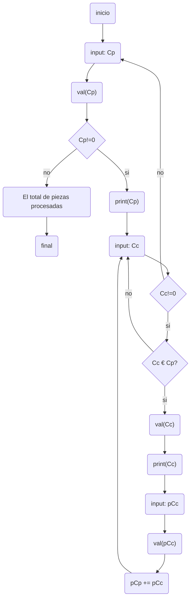

# Trabajo final - IC

Boceto para realizar el trabajo final de Introducción a Ingeniería en Computación.

## Pseudo-código

Variables: [codigo_de_pieza, codigo_de_componente, precio_del_componente, precio_de_la_pieza, total_de_piezas]

**Inicio**  
[_declaracion de variables_]  
(A) Ingresar código de pieza: codigo_de_pieza  
Validar codigo_de_pieza:  
- codigo_de_pieza es número natural
- 01 <= codigo_de_pieza <= 99   

% Si (validar(codigo_de_pieza)): False -> (A)  
% Si (validar(codigo_de_pieza)): True  
% Si (codigo_de_pieza == 0): True -> (fin) "muestra total piezas"
% Si (codigo_de_pieza == 0): False  
[Salida] Imprimir por pantalla codigo_de_pieza  
[_declaracion de variables_]  
(B) Ingresar código de componente: codigo_de_componente  

Validad codigo_de_componente:  
- codigo_de_componente es número natural  
- 01 <= codigo_de_componente <= 99  

% Si (validar(codigo_de_componente)): Flase -> (B)  
% Si (validar(codigo_de_componente)): True  
% Si (codigo_de_componente == 0): True  
[Salida] Imprime precio de la pieza: precio_de_la_pieza  
[Retorna] -> (A)  
% Si (codigo_de_componente == 0): False  
[Salida] Imprimir por pantalla codigo_de_componente  
[_declaración de variables_]  
(C) Ingresar precio del componente: precio_del_componente

Validar precio_del_componente:  
- precio_del_componente es numero flotante  
- 10.00 <= precio_del_componente <= 999.99  

% Si (validar_precio(precio_del_componente)): False -> (C)  
% Si (validar_precio(precio_del_componente)): True  
[Asignar] precio_de_la_pieza += precio_del_componente  
[Retorna] -> (C)

**Final**

## Diagrama en mermaid

