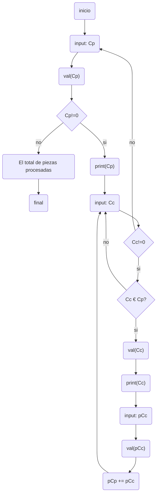

# Trabajo final

Boceto para realizar el trabajo final de Introducción a Ingeniería en Computación.

## Pseudo-código

Variables: [codigo_de_pieza, codigo_de_componente, precio_de_componente, precio_de_pieza, cantidad_piezas]

**Inicio**  
[_declaracion de variables_]  
(A) Ingresar código de pieza: codigo_de_pieza  
Validar codigo_de_pieza:  
- codigo_de_pieza es número
- 01 <= codigo_de_pieza <= 99   

% validar(codigo_de_pieza): False -> (A)  
% validar(codigo_de_pieza): True  
% codigo_de_pieza == 0: True -> (fin) "muestra total piezas"
% codigo_de_pieza == 0: False  
Imprimir por pantalla codigo_de_pieza  
[_declaracion de variables_]  
(B) Ingresar codigo_de_componente

## Diagrama en mermaid

